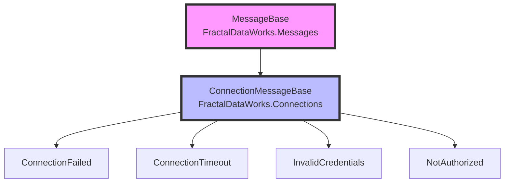

# Message Collection Strategies for Connection Providers

This document outlines different strategies for organizing messages in provider-based architectures, such as database connection providers.

## Overview

When creating connection providers (e.g., MsSql, PostgreSQL, MongoDB), you need to decide how to organize provider-specific messages. The FractalDataWorks.Messages and EnhancedEnums framework provides several patterns to achieve this.

## Current Architecture



The base `ConnectionMessageBase` generates a `ConnectionMessages` static collection containing only messages defined in the Connections assembly.

## Strategies for Provider Messages

### Strategy 1: Separate Collections per Provider (Recommended)

Each provider maintains its own message collection, providing clear separation and modularity.

```csharp
// In FractalDataWorks.Connections.MsSql
namespace FractalDataWorks.Connections.MsSql.Messages;

[EnhancedEnumBase("MsSqlMessages", ReturnType = "IFdwMessage", ReturnTypeNamespace = "FractalDataWorks")]
public abstract class MsSqlMessageBase : ConnectionMessageBase
{
    protected MsSqlMessageBase(int id, string name, string code, string message, MessageSeverity severity)
        : base(id, name, code, message, severity) { }
}

[EnumOption]
public class SqlServerConnectionTimeout : MsSqlMessageBase
{
    public SqlServerConnectionTimeout() 
        : base(1001, "SqlServerConnectionTimeout", "MSSQL_001", 
               "SQL Server connection timeout after {0} seconds", MessageSeverity.Error) { }
}

[EnumOption]
public class SqlServerDeadlockVictim : MsSqlMessageBase
{
    public SqlServerDeadlockVictim() 
        : base(1002, "SqlServerDeadlockVictim", "MSSQL_002", 
               "Transaction was chosen as deadlock victim", MessageSeverity.Error) { }
}
```

**Benefits:**
- ✅ Clear separation between providers
- ✅ No cross-assembly scanning needed
- ✅ Each provider can be deployed independently
- ✅ Easy to understand which messages belong to which provider

**Usage:**
```csharp
// Access base connection messages
var timeout = ConnectionMessages.ConnectionTimeout;

// Access SQL Server specific messages
var deadlock = MsSqlMessages.SqlServerDeadlockVictim;
```

### Strategy 2: Cross-Assembly Collection

Enable cross-assembly scanning to automatically include all provider messages in a single collection.

```csharp
// Modify ConnectionMessageBase in FractalDataWorks.Connections
[EnhancedEnumBase("ConnectionMessages", 
    IncludeReferencedAssemblies = true, 
    ReturnType = "IFdwMessage", 
    ReturnTypeNamespace = "FractalDataWorks")]
public abstract class ConnectionMessageBase : MessageBase { }

// In FractalDataWorks.Connections.MsSql - no [EnhancedEnumBase] needed
public abstract class MsSqlMessageBase : ConnectionMessageBase { }

[EnumOption]
public class SqlServerConnectionTimeout : MsSqlMessageBase { }
```

**Benefits:**
- ✅ All connection messages in one collection
- ✅ Simpler access pattern

**Drawbacks:**
- ❌ Requires all providers to be referenced at build time
- ❌ Can include unintended messages
- ❌ Tighter coupling between assemblies

### Strategy 3: Aggregator Pattern

Create aggregator collections that combine messages from multiple sources.

```csharp
// In FractalDataWorks.Connections.MsSql
[EnhancedEnumBase("AllMsSqlMessages", 
    IncludeReferencedAssemblies = true,
    ReturnType = "IFdwMessage")]
public abstract class MsSqlMessageAggregator : ConnectionMessageBase { }

// This collection will include:
// - Base ConnectionMessages (from referenced assembly)
// - MsSql-specific messages (from current assembly)
```

**Benefits:**
- ✅ Flexible - each provider decides what to include
- ✅ Can aggregate messages from multiple sources
- ✅ Consumer chooses aggregation level

**Usage:**
```csharp
// Get all messages related to SQL Server
var allMessages = AllMsSqlMessages.All;
```

### Strategy 4: Hierarchical Collections

Create a hierarchy of message collections for different levels of specificity.

```csharp
// Base messages
[EnhancedEnumBase("ConnectionMessages")]
public abstract class ConnectionMessageBase : MessageBase { }

// Provider category messages
[EnhancedEnumBase("RelationalDbMessages")]
public abstract class RelationalDbMessageBase : ConnectionMessageBase { }

// Specific provider messages
[EnhancedEnumBase("MsSqlMessages")]
public abstract class MsSqlMessageBase : RelationalDbMessageBase { }
```

**Benefits:**
- ✅ Natural hierarchy matching provider relationships
- ✅ Can query at different levels of abstraction
- ✅ Supports shared messages across similar providers

## Recommended Approach

For the FractalDataWorks.Connections architecture, we recommend **Strategy 1: Separate Collections per Provider** because:

1. **Modularity**: Each provider is self-contained with its own messages
2. **Independence**: Providers can be developed, tested, and deployed independently
3. **Clarity**: It's immediately clear which messages belong to which provider
4. **Performance**: No cross-assembly scanning overhead
5. **Flexibility**: Consumers can reference only the providers they need

## Implementation Example

```csharp
// FractalDataWorks.Connections.MsSql/Messages/MsSqlMessageBase.cs
[EnhancedEnumBase("MsSqlMessages", ReturnType = "IFdwMessage")]
public abstract class MsSqlMessageBase : ConnectionMessageBase
{
    // ID ranges: 1000-1999 reserved for SQL Server
    protected MsSqlMessageBase(int id, string name, string code, string message, MessageSeverity severity)
        : base(id, name, code, message, severity) 
    { 
        if (id < 1000 || id >= 2000)
            throw new ArgumentOutOfRangeException(nameof(id), "SQL Server message IDs must be in range 1000-1999");
    }
}

// FractalDataWorks.Connections.PostgreSql/Messages/PostgreSqlMessageBase.cs
[EnhancedEnumBase("PostgreSqlMessages", ReturnType = "IFdwMessage")]
public abstract class PostgreSqlMessageBase : ConnectionMessageBase
{
    // ID ranges: 2000-2999 reserved for PostgreSQL
    protected PostgreSqlMessageBase(int id, string name, string code, string message, MessageSeverity severity)
        : base(id, name, code, message, severity) 
    { 
        if (id < 2000 || id >= 3000)
            throw new ArgumentOutOfRangeException(nameof(id), "PostgreSQL message IDs must be in range 2000-2999");
    }
}
```

## Message ID Allocation

To avoid conflicts, establish ID ranges for each provider:

| Provider | ID Range | Code Prefix |
|----------|----------|-------------|
| Base Connection | 1-999 | CONN_ |
| SQL Server | 1000-1999 | MSSQL_ |
| PostgreSQL | 2000-2999 | PG_ |
| MongoDB | 3000-3999 | MONGO_ |
| Redis | 4000-4999 | REDIS_ |

## Consumer Usage

Applications using multiple providers can access messages from each collection:

```csharp
public class DatabaseService
{
    public IFdwMessage HandleSqlServerError(SqlException ex)
    {
        return ex.Number switch
        {
            -2 => MsSqlMessages.SqlServerConnectionTimeout,
            1205 => MsSqlMessages.SqlServerDeadlockVictim,
            _ => ConnectionMessages.ConnectionFailed
        };
    }
    
    public IFdwMessage HandlePostgreSqlError(NpgsqlException ex)
    {
        return ex.SqlState switch
        {
            "08006" => PostgreSqlMessages.ConnectionFailure,
            "40P01" => PostgreSqlMessages.DeadlockDetected,
            _ => ConnectionMessages.ConnectionFailed
        };
    }
}
```

## Testing Considerations

With separate collections, testing is simplified:

```csharp
[Fact]
public void MsSqlMessages_ShouldOnlyContainSqlServerMessages()
{
    var messages = MsSqlMessages.All;
    
    Assert.All(messages, msg => 
    {
        Assert.StartsWith("MSSQL_", msg.Code);
        Assert.InRange(msg.Id, 1000, 1999);
    });
}
```

## Migration Path

If you later decide to aggregate messages, you can add an aggregator without breaking existing code:

```csharp
// Add this to a consuming application
[EnhancedEnumBase("AllDatabaseMessages", IncludeReferencedAssemblies = true)]
public abstract class DatabaseMessageAggregator : MessageBase { }

// This will collect all messages from all referenced database providers
```